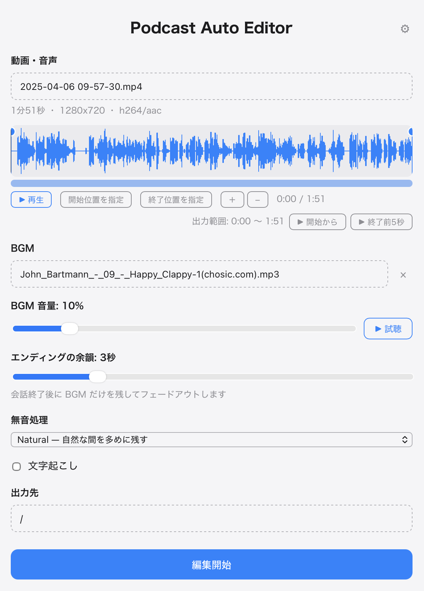

# Podcast Auto Editor

Google Meet などで録画したポッドキャスト動画（もしくは音声ファイル）を入れると、

1. 長すぎる無音を「自然な長さ」に短縮し（削除ではなく短縮です）
2. BGM をループ・フェード付きで追加し
3. 音量をポッドキャスト向けに調整し（-16 LUFS）
4. 日本語をローカルで文字起こしして

編集済み MP4 / ポッドキャスト用 MP3 / 文字起こし (TXT・JSON・SRT・Markdown) を出力するツールです。  
出力するファイルは GUI 右上の歯車から進める設定画面で選べます。

動画・音声・文字起こしデータを外部サーバーへ送信せず、完全ローカル・無料で動作します。  

<p align="center">
  
</p>

## 対応 OS

- macOS (Apple Silicon) — 対応
- Windows — 未対応。将来対応予定の構成にしています

## 現在の状態

CLI とデスクトップ GUI (Tauri 2) が動作します。  
FFmpeg の sidecar 同梱・アプリ配布用ビルドは今後対応予定です。

## 必要な開発環境

- Rust (stable)
- Node.js（デスクトップ GUI の開発に必要）
- ffmpeg / ffprobe（開発中は Homebrew 等のものを使います）
- cmake（whisper.cpp のビルドに必要）
- Xcode Command Line Tools

```bash
brew install ffmpeg cmake
```

## デスクトップアプリの起動

```bash
make setup   # 初回のみ (npm install)
make run-dev
```

動画をウィンドウへドラッグ＆ドロップ（またはクリックで選択）し、  
「編集開始」を押すだけですべて生成されます。  
BGM・音量・プリセットなどの設定は保存され、次回のデフォルトになります。

## ビルドと実行

```bash
cargo build

# 基本の使い方: 動画を入れると output/ に一式が生成される
cargo run -p pae-cli -- run input.mp4 --bgm bgm.mp3 -o output
```

出力ファイルは入力名から自動生成されます:

```text
input-edited.mp4      編集済み動画 (BGM・音量調整込み)
input-podcast.mp3     ポッドキャスト用音声
input-transcript.txt  文字起こし
input-transcript.json タイムスタンプ付き文字起こし
input-transcript.srt  字幕
input-transcript.md   Markdown
input-timeline.json   編集タイムライン (手修正して再利用可)
```

主なオプション:

```text
--preset natural|standard|aggressive  無音短縮の強さ (デフォルト: natural)
--bgm <file>        BGM ファイル。一度指定すると設定に保存され次回のデフォルトになる
--no-bgm            BGM を付けない
--bgm-volume 0.15   BGM 音量 (会話に対する倍率)
--fade-in / --fade-out  BGM のフェード時間 (秒)
--ending-tail 5     会話終了後に BGM だけを残す余韻 (秒, 0 で無効)
--bgm-duck -4       声の帯域で BGM を下げる量 (dB, 0 で無効)
--lufs -16          ラウドネスターゲット
--model <name>      文字起こしモデル (pae models list で一覧)
--skip-transcribe   文字起こしを省略
```

### 2段階での実行（タイムラインの確認・手修正）

```bash
# 解析のみ: どこをどれだけ短縮するかを timeline.json に出力
cargo run -p pae-cli -- analyze input.mp4 -o timeline.json

# timeline.json を（必要なら手修正して）使って書き出し
cargo run -p pae-cli -- render input.mp4 -t timeline.json -o output
```

### 文字起こしモデル

初回利用時に自動でダウンロードされ、  
`~/Library/Application Support/net.hatone.PodcastAutoEditor/models/` に保存されます。

```bash
cargo run -p pae-cli -- models list      # 一覧と状態
cargo run -p pae-cli -- models download large-v3-turbo
```

- `large-v3-turbo` (約574MB) — デフォルト。日本語の自由会話に強い
- `kotoba-v2.0` (約538MB) — 日本語特化。明瞭な音声向け
- `tiny` (約78MB) — テスト用

## テスト

```bash
cargo test                          # ユニット + 統合テスト (ffmpeg 必須)
cargo test -p pae-core -- --ignored # モデルダウンロードが必要なテスト
./scripts/make-fixtures.sh          # テスト用メディアの生成
```

## formatter / linter

```bash
cargo fmt
cargo clippy --all-targets
```

## FFmpeg の扱い

開発中は PATH 上の ffmpeg / ffprobe を使います。  
（環境変数 `PAE_FFMPEG_DIR` でディレクトリを指定して上書きできます）

配布は予定していませんが、その場合は LGPL 構成の ffmpeg を sidecar として同梱する予定です。  
詳細は [docs/tech-notes.md](docs/tech-notes.md) を参照してください。

## 設定ファイル

`~/Library/Application Support/net.hatone.PodcastAutoEditor/config.toml` に保存されます。  
デフォルト BGM・音量・プリセット・モデルなどを記憶します。

## 処理時間の目安

Apple Silicon で入力実時間の 0.2〜0.25 倍程度です。（60分動画で約13分）  
各実行の最後にステージ別の処理時間と real-time factor が表示されます。
